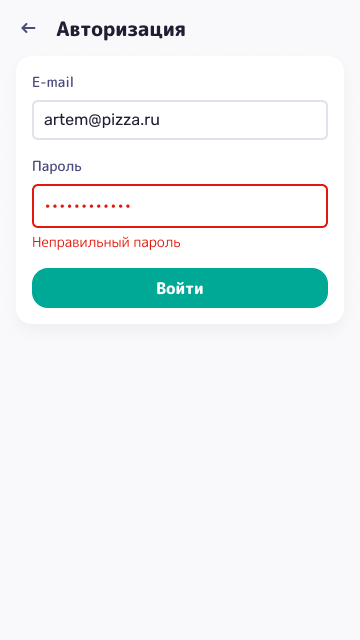
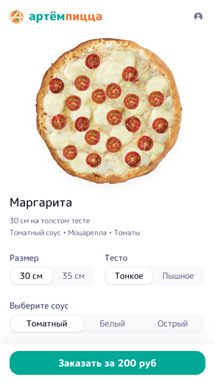
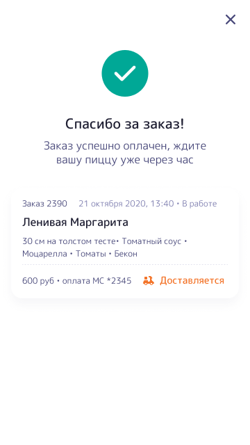
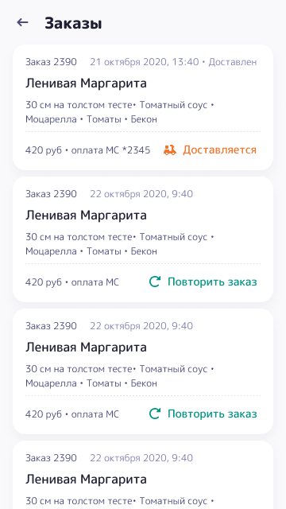

# Pizza (Work in progress)

[](https://app.netlify.com/sites/distracted-fermi-c7c64b/deploys)

"Pizza" is a react app for buying pizza.
Mobile first design.

## Installation

Use the package manager [yarn](https://yarnpkg.com/) to install app.

```bash
yarn install
```

## Usage

```bash
yarn start
```

## Application pages
<details>
  <summary>Click to expand screens</summary>
  

---

---

---

---

</details>
